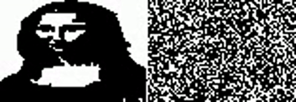

# Mona Carlo

* Monte carlo optimisation of a randomised black and white grid to reconstruct the mona lisa
* Uses swap and translation moves to update the randomised image, accepting the move if the system delta is lowered